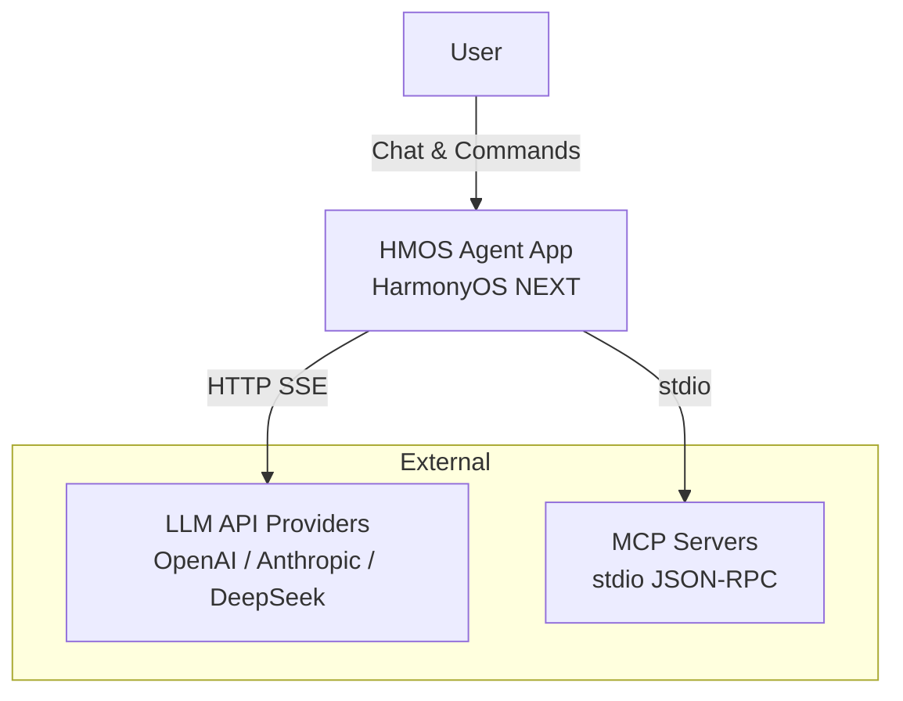
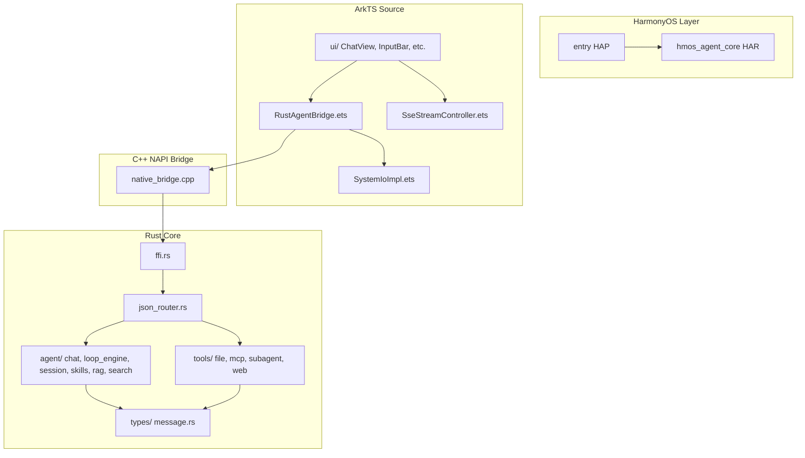
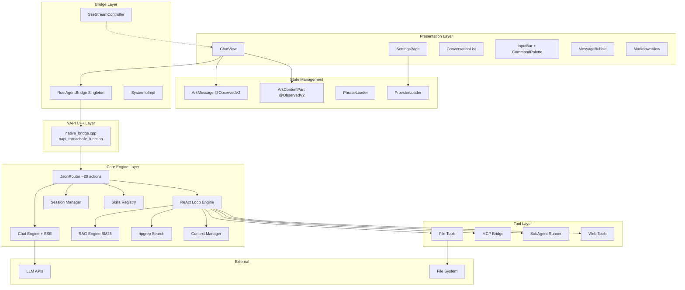
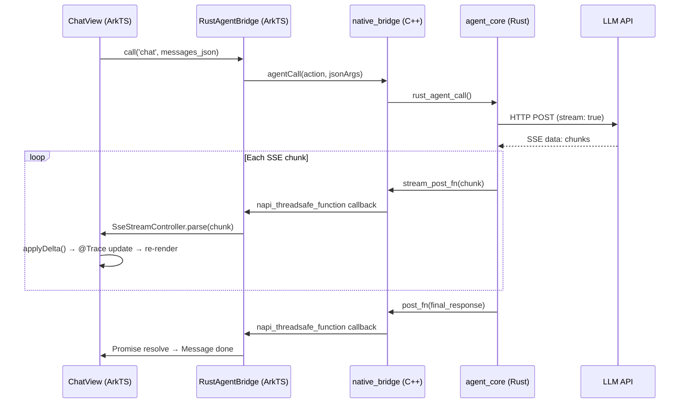
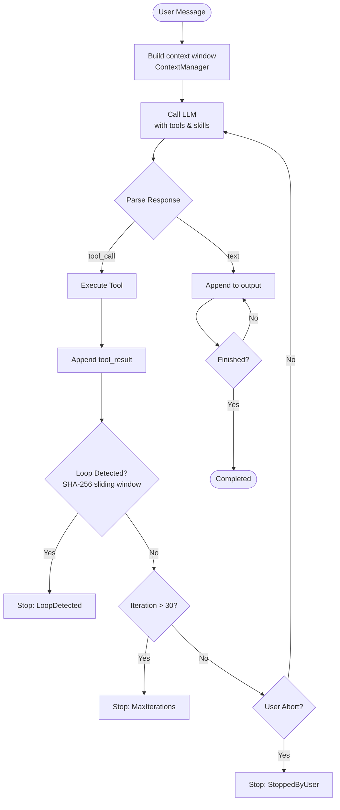

# Architecture

## 1. C4 System Context

```mermaid
graph TB
    User[User]
    HMOS[HMOS Agent App<br/>HarmonyOS NEXT]

    subgraph External
        LLM[LLM API Providers<br/>OpenAI / Anthropic / DeepSeek]
        MCP_SERVERS[MCP Servers<br/>stdio JSON-RPC]
    end

    User -->|Chat & Commands| HMOS
    HMOS -->|HTTP SSE| LLM
    HMOS -->|stdio| MCP_SERVERS
```

## 2. Dependency Topology

```mermaid
graph TD
    subgraph "HarmonyOS Layer"
        ENTRY[entry HAP]
        HAR[hmos_agent_core HAR]
        ENTRY --> HAR
    end

    subgraph "ArkTS Source"
        UI[ui/ ChatView, InputBar, etc.]
        BRIDGE[RustAgentBridge.ets]
        IO[SystemIoImpl.ets]
        SSE[SseStreamController.ets]
        UI --> BRIDGE
        UI --> SSE
        BRIDGE --> IO
    end

    subgraph "C++ NAPI Bridge"
        NB[native_bridge.cpp]
    end

    subgraph "Rust Core"
        FFI[ffi.rs]
        ROUTER[json_router.rs]
        AGENT[agent/ chat, loop_engine, session, skills, rag, search]
        TOOLS[tools/ file, mcp, subagent, web]
        TYPES[types/ message.rs]
        FFI --> ROUTER
        ROUTER --> AGENT
        ROUTER --> TOOLS
        AGENT --> TYPES
        TOOLS --> TYPES
    end

    BRIDGE --> NB
    NB --> FFI
```

## 3. Layered Architecture

```mermaid
graph TB
    subgraph "Presentation Layer"
        CHAT[ChatView]
        SETTINGS[SettingsPage]
        CONV[ConversationList]
        INPUT[InputBar + CommandPalette]
        BUBBLE[MessageBubble]
        MD[MarkdownView]
    end

    subgraph "State Management"
        MSG[ArkMessage @ObservedV2]
        PART[ArkContentPart @ObservedV2]
        PHRASE[PhraseLoader]
        PROV[ProviderLoader]
    end

    subgraph "Bridge Layer"
        RAB[RustAgentBridge Singleton]
        SSE_CTRL[SseStreamController]
        SYS_IO[SystemIoImpl]
    end

    subgraph "NAPI C++ Layer"
        NAPI[native_bridge.cpp<br/>napi_threadsafe_function]
    end

    subgraph "Core Engine Layer"
        ROUTER[JsonRouter ~20 actions]
        CHAT_ENG[Chat Engine + SSE]
        LOOP[ReAct Loop Engine]
        SESSION[Session Manager]
        SKILLS[Skills Registry]
        RAG_ENG[RAG Engine BM25]
        SEARCH[ripgrep Search]
        CONTEXT[Context Manager]
    end

    subgraph "Tool Layer"
        FILE[File Tools]
        MCP[MCP Bridge]
        SUB[SubAgent Runner]
        WEB[Web Tools]
    end

    subgraph "External"
        LLM[LLM APIs]
        FS[File System]
    end

    CHAT --> MSG
    CHAT --> PART
    SETTINGS --> PROV
    CHAT --> RAB
    RAB --> NAPI
    NAPI --> ROUTER
    SSE_CTRL -.-> CHAT
    ROUTER --> CHAT_ENG
    ROUTER --> LOOP
    ROUTER --> SESSION
    ROUTER --> SKILLS
    LOOP --> RAG_ENG
    LOOP --> SEARCH
    LOOP --> CONTEXT
    LOOP --> FILE
    LOOP --> MCP
    LOOP --> SUB
    LOOP --> WEB
    CHAT_ENG --> LLM
    FILE --> FS
```

## 4. Data Flow: SSE Streaming

```mermaid
sequenceDiagram
    participant UI as ChatView (ArkTS)
    participant Bridge as RustAgentBridge (ArkTS)
    participant NAPI as native_bridge (C++)
    participant Rust as agent_core (Rust)
    participant LLM as LLM API

    UI->>Bridge: call('chat', messages_json)
    Bridge->>NAPI: agentCall(action, jsonArgs)
    NAPI->>Rust: rust_agent_call()

    Rust->>LLM: HTTP POST (stream: true)
    LLM-->>Rust: SSE data: chunks

    loop Each SSE chunk
        Rust->>NAPI: stream_post_fn(chunk)
        NAPI->>Bridge: napi_threadsafe_function callback
        Bridge->>UI: SseStreamController.parse(chunk)
        UI->>UI: applyDelta() → @Trace update → re-render
    end

    Rust->>NAPI: post_fn(final_response)
    NAPI->>Bridge: napi_threadsafe_function callback
    Bridge->>UI: Promise resolve → Message done
```

## 5. ReAct Agent Loop

```mermaid
flowchart TD
    START([User Message]) --> PREP[Build context window<br/>ContextManager]
    PREP --> THINK[Call LLM<br/>with tools & skills]

    THINK --> PARSE{Parse Response}
    PARSE -->|text| APPEND[Append to output]
    PARSE -->|tool_call| EXEC[Execute Tool]

    APPEND --> CHECK_DONE{Finished?}
    EXEC --> OBSERVE[Append tool_result]
    OBSERVE --> DETECT{Loop Detected?<br/>SHA-256 sliding window}
    DETECT -->|Yes| STOP_LOOP[Stop: LoopDetected]
    DETECT -->|No| CHECK_MAX{Iteration > 30?}
    CHECK_MAX -->|Yes| STOP_MAX[Stop: MaxIterations]
    CHECK_MAX -->|No| CHECK_ABORT{User Abort?}
    CHECK_ABORT -->|Yes| STOP_USER[Stop: StoppedByUser]
    CHECK_ABORT -->|No| THINK
    CHECK_DONE -->|No| APPEND
    CHECK_DONE -->|Yes| DONE([Completed])
```

