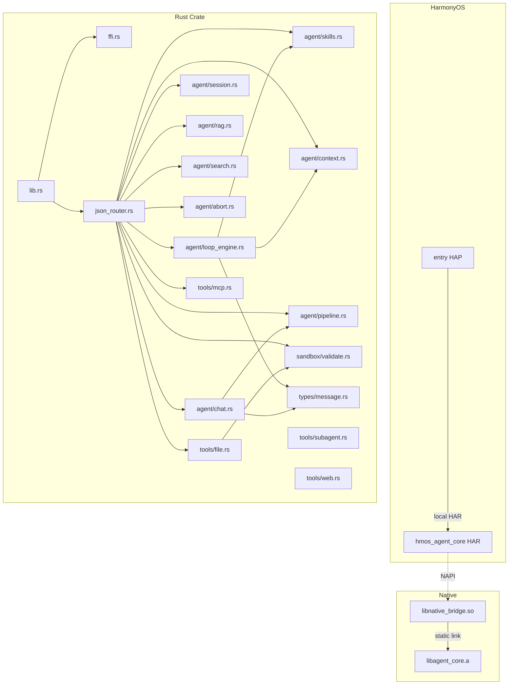

# Dependencies

## Module Dependency Graph

## External Dependencies (Rust Crate)

| Crate | Version | License | Purpose |
|-------|---------|---------|---------|
| serde | 1.x | MIT/Apache-2.0 | JSON serialization framework |
| serde_json | 1.x | MIT/Apache-2.0 | JSON value manipulation |
| sha2 | 0.10 | MIT/Apache-2.0 | SHA-256 hashing |
| ureq | 3.x | MIT/Apache-2.0 | HTTP client (rustls TLS) |
| ignore | 0.4 | Unlicense/MIT | Gitignore-aware directory traversal |
| grep-regex | 0.1 | Unlicense/MIT | Regex search engine |
| grep-searcher | 0.1 | Unlicense/MIT | File search execution |
| wasm-bindgen | 0.2 (optional) | MIT/Apache-2.0 | WASM JS interop |
| napi / napi-derive | 2.x (optional) | MIT | Node.js NAPI bindings |

## HarmonyOS Dependencies

| Package | Version | Scope |
|---------|---------|-------|
| @ohos/hypium | (SDK bundled) | Dev (testing) |
| @ohos/hamock | (SDK bundled) | Dev (mocking) |

## Internal Cross-Layer Dependencies

| From | To | Mechanism |
|------|-----|-----------|
| ArkTS (RustAgentBridge) | C++ (native_bridge) | NAPI direct call |
| C++ (native_bridge) | Rust (ffi.rs) | C ABI extern "C" |
| Rust → ArkTS (callback) | RustAgentBridge | napi_threadsafe_function |
| Rust (ffi.rs) | Rust (json_router) | Internal fn call |
| json_router | agent modules | Internal module dispatch |
| agent modules | tools modules | Internal module calls |
| agent modules | types module | Internal type usage |

## Build-Time Dependencies

| Stage | Tool | Input | Output |
|-------|------|-------|--------|
| Rust build | cargo (OHOS NDK) | rust_core/agent_core/src/ | libagent_core.a |
| Header gen | cbindgen | rust_core/agent_core/src/ffi.rs | agent_core.h |
| Native build | CMake + Ninja | native_bridge.cpp + libagent_core.a | libnative_bridge.so |
| HAR build | hvigor | hmosagent/hmos_agent_core/ | .har file |
| HAP build | hvigor | hmosagent/entry/ + .har | .hap file (signed) |

